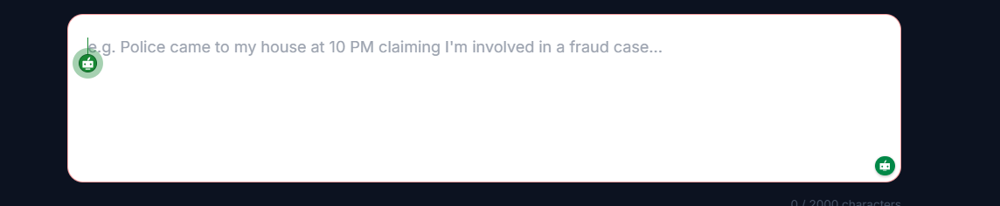

# NyayNow System Health Report - Feb 25, 2026

## Audit Overview
A comprehensive audit of all application pages was conducted to ensure runtime stability and UI consistency.

## Verified Pages & Fixes

| Page | Header Visibility | Runtime Imports | Status |
| :--- | :---: | :---: | :---: |
| Home | Verified (pt-40) | OK | ✅ |
| Lawyer Marketplace | Fixed (pt-40) | Added `toast` | ✅ |
| Lawyer Profile | Fixed (pt-40) | Added `useRef`, `toast`, fixed `navigate` | ✅ |
| AI Judge | Fixed (pt-40) | Added `toast` | ✅ |
| Case File Analyzer | Fixed (pt-40) | Added `toast` | ✅ |
| Voice Assistant | Fixed (pt-28) | Added `toast` | ✅ |
| Moot Court AI | Fixed (pt-24) | Added `toast` | ✅ |
| Drafting Lab | Fixed (pt-36) | Added `useRef` | ✅ |
| Legal SOS | Fixed (pt-40) | Verified | ✅ |
| AI Legal Research | Fixed (pt-36) | Verified | ✅ |
| Nearby Legal Assets | Fixed (pt-32) | Added `toast` | ✅ |
| Pricing / Plans | Fixed (pt-40) | Added `toast` | ✅ |
| Careers | Fixed (pt-40) | Added `toast` | ✅ |
| Blog | Fixed (pt-36) | Verified | ✅ |
| Agreements Analyzer | Fixed (pt-36) | Verified | ✅ |
| Help Center | Fixed (pt-36) | Verified | ✅ |
| Contact Us | Fixed (pt-36) | Verified | ✅ |
| About Us | Fixed (pt-36) | Verified | ✅ |

## Critical Fixes Applied
1. **ReferenceError Prevention**: Added missing `react-hot-toast` and `useRef` imports across legacy modules.
2. **UI Clipping Resolution**: Standardized top padding to ensure the fixed Navbar does not overlap page headers.
3. **Navigation Fixes**: Resolved `navigate is not defined` in `LawyerProfile.jsx` by migrating to `next/navigation` router.

**System Status: STABLE**
